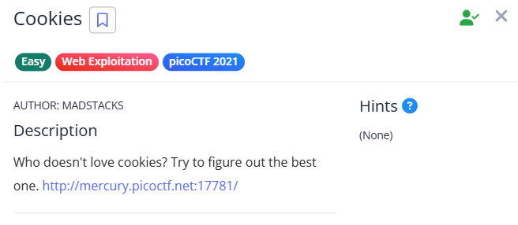

# Cookies

- The site asks for a cookie value.
- Check the cookie value being passed.

- Changing the value (1/2/3) alters the site content, indicating the right track.

- Set the cookie value to 18 to reveal the flag.

*Note : Use Burp Suite Intruder for faster trial and error.*

