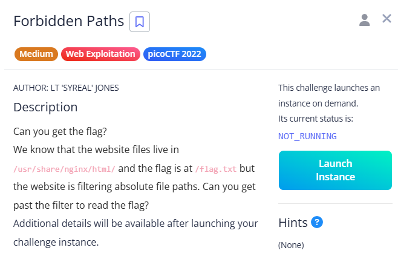

# Forbidden Paths

site:

The challenge hints at `/usr/share/nginx/html/`, and the flag is at `/flag.txt`, but absolute paths are filtered.

This is a path traversal issue.

Since we know the web root, using `../../../../../flag.txt` bypasses the filter and reveals the flag.

