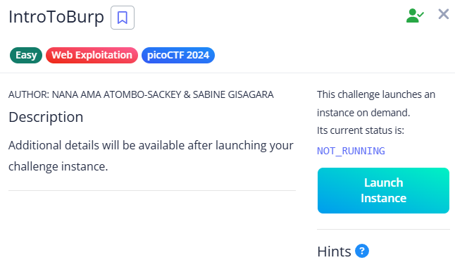

# IntroToBurp

- A registration form is given.

- Register to receive an OTP.

- Intercept the OTP request with Burp Suite.
- Modify the request by clearing the OTP check section and forward it.

- This reveals the flag.

