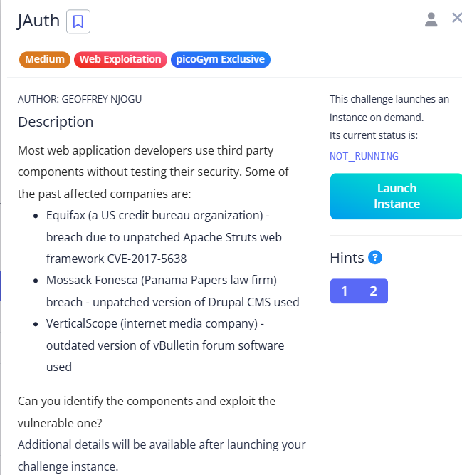

# JAuth



To solve this challenge, we needed a clear understanding of **JWT (JSON Web Token)**. A typical JWT consists of **three parts**:

```
header.payload.signature

```

In this challenge, after logging in, a JWT token was issued. The application used this token to manage user roles and access control.

### Step 1: Decode the JWT

Using [https://token.dev/](https://token.dev/), I decoded the token. It revealed the following:

**Header:**

```json
{
  "typ": "JWT",
  "alg": "HS256"
}

```

**Payload:**

```json
{
  "auth": 1748346440000,
  "agent": "Mozilla/5.0 (Windows NT 10.0; Win64; x64) AppleWebKit/537.36 (KHTML, like Gecko) Chrome/125.0.6422.60 Safari/537.36",
  "role": "user",
  "iat": 1748346440
}

```

### 

Step 2: Modify the Token

- I changed the `"role"` from `"user"` to `"admin"`.
- Then, I modified the header `"alg"` from `"HS256"` to `"none"`.

> Why none?
> 
> 
> Setting `"alg": "none"` tells the server *not* to verify the signature. This effectively **bypasses token validation** if the server accepts it — a known JWT vulnerability in poorly configured systems.
> 

### Step 3: Craft the New Token

Here’s the modified JWT (Base64-encoded header and payload):


### Step 4: Send the Token

I replaced the original token with the modified one and sent the request.

The server accepted the token and granted **admin access**, revealing the **flag**.

***Note:** The final **dot (`.`)** at the end is **crucial** — it signifies the absence of a signature.*


