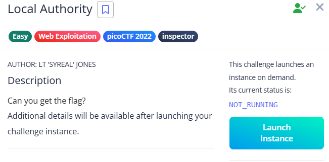

# Local Authority

- A login page appears.

- Test with dummy credentials: test:test.
- Login fails. View the page source and find a secure.js file containing valid credentials.

- Log in with those credentials to reveal the flag.

