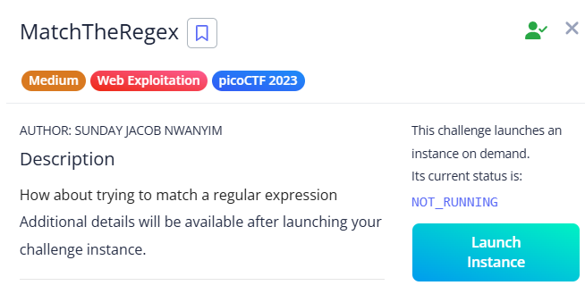

# MatchTheRegex

While inspecting the frontend JavaScript code, I found a function called `send_request()` that grabs input from a field and sends a GET request to `/flag?input=...`. It expects a JSON response containing the flag and displays it using `alert(res_json.flag)`.

A commented line in the code caught my attention:

This looked like a regular expression hint suggesting the required input pattern:

- Starts with `p`
- Followed by any 5 characters
- Then `F`
- And optionally `!` or `?`

After crafting inputs that match this pattern (like `p12345F!` or `pABCDEFa`), I found the correct one — and the server responded with a JSON containing the flag, which was shown in the alert popup.

