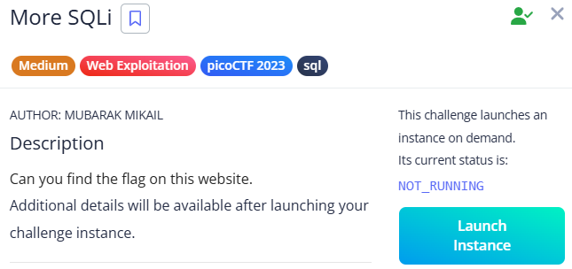

# More SQLi



A login form:


Inside the login form, I noticed that the application echoed back my input in the response like this:


**In SQL, `AND` has higher precedence than `OR`.**

So,the logic wouldn't work as expected.

I tried the classic payload in passwd field:

```
' OR 1=1 --

```

- `'` closes the existing quote in the SQL query.
- `OR 1=1` is always true.
- `-` comments out the rest of the query to avoid syntax errors.

After submitting it as the username (and anything for the password), the resulting query became:

```
SELECT id FROM users WHERE password = '' AND username = '' OR 1=1 --'

```

This bypassed the login because the `OR 1=1` condition made the `WHERE` clause always true, and the `--` ignored the rest.


