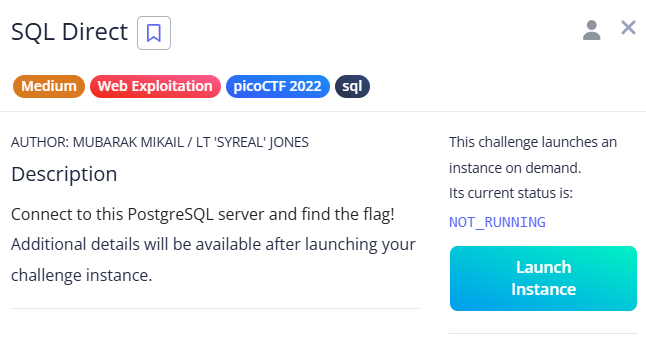

# SQL Direct

After connecting to the PostgreSQL terminal, I checked the list of available databases using `\l` and confirmed I was already in the `pico` database. 

Then I used `\dt` to list all tables, which revealed a table named `flags`. 

Running a simple `SELECT * FROM flags;` displayed the flag in the output.

