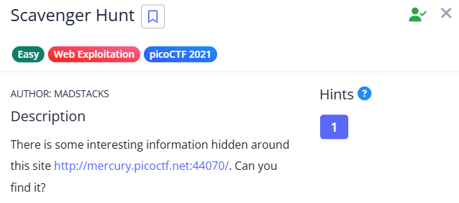

# Scavenger Hunt

- Inspect the site and find two parts of the flag directly in the source files

Now to solve the problem, we need to understand the use of these files:

### **1. `robots.txt`**

As an attacker, `robots.txt` helps identify hidden or restricted areas of a website, like `/admin/` or `/private/`, which may be vulnerable and worth exploring.

### **2. `.htaccess` (for Apache)**

The `.htaccess` file can reveal security misconfigurations, like weak redirects or access controls, which could be exploited to bypass restrictions or escalate privileges.

### **3. `.DS_Store` (for macOS)**

The `.DS_Store` file is often left on servers by macOS users. Its presence can indicate poor file management and potentially signal a misconfigured server vulnerable to further attacks.

- Check these files in the browser URL to find parts of the flag.
- Combine them to get the full flag.
