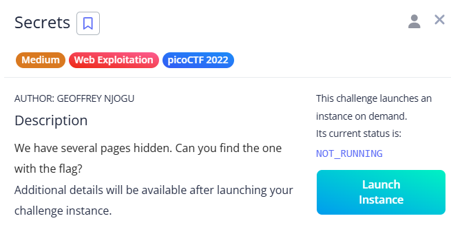

# Secrets

This challenge required carefully inspecting the source code of multiple pages in sequence. By following the clues hidden in the source code across three different pages, I was able to uncover the path to the final flag. Images are given bellow. Check the at the URL for each,

source code:

---

Source code:

---

Source code:

---

Source code:

