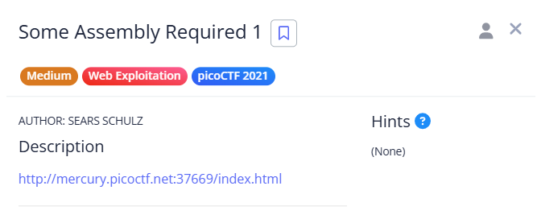

# Some Assembly Required 1

**The flag was directly visible in the page response.**

Just loaded the page, type anything and hit enter and inspected the response. The flag was right there, plain and simple.

