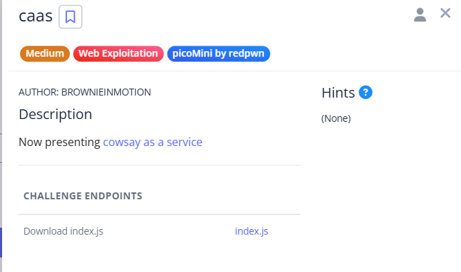

# caas



Source code:

```jsx
const express = require('express');
const app = express();
const { exec } = require('child_process');

app.use(express.static('public'));

app.get('/cowsay/:message', (req, res) => {
  exec(`/usr/games/cowsay ${req.params.message}`, {timeout: 5000}, (error, stdout) => {
    if (error) return res.status(500).end();
    res.type('txt').send(stdout).end();
  });
});

app.listen(3000, () => {
  console.log('listening');
});

```

While examining the source code, I noticed the server was using the Node.js `exec` function to run the command:

```
/usr/games/cowsay ${req.params.message}

```

The input parameter `message` was directly appended to the shell command without any sanitization or validation, making it vulnerable to command injection.

To test this, I appended a semicolon (`;`) followed by the `ls` command to the URL, like this:

```
/cowsay/hello;ls

```

The semicolon allows chaining multiple commands in a shell, so the server executed both `/usr/games/cowsay hello` and `ls`. This revealed the contents of the current directory, including the `falg.txt` file.


Finally, to read the flag, I executed:

```
/cowsay/hello;cat falg.txt

```

This successfully printed the flag


