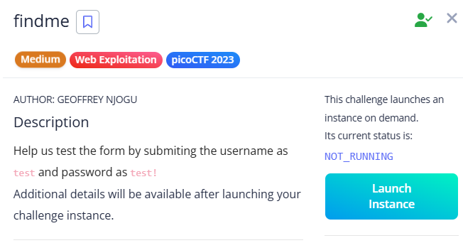

# findme

site:

Entered the credentials and kept Burp Suite running to capture traffic.
Monitored the requests and responses carefully.

The flag was hidden in the responses of two different redirects—encrypted and split across them.
Combining both parts revealed the complete flag.

